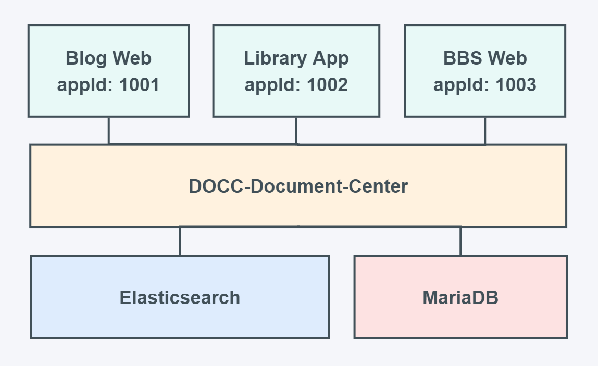
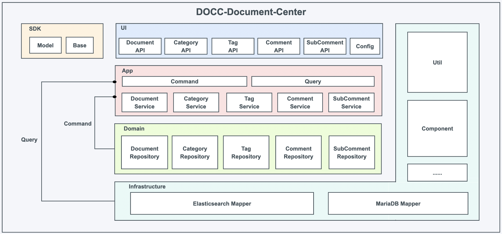
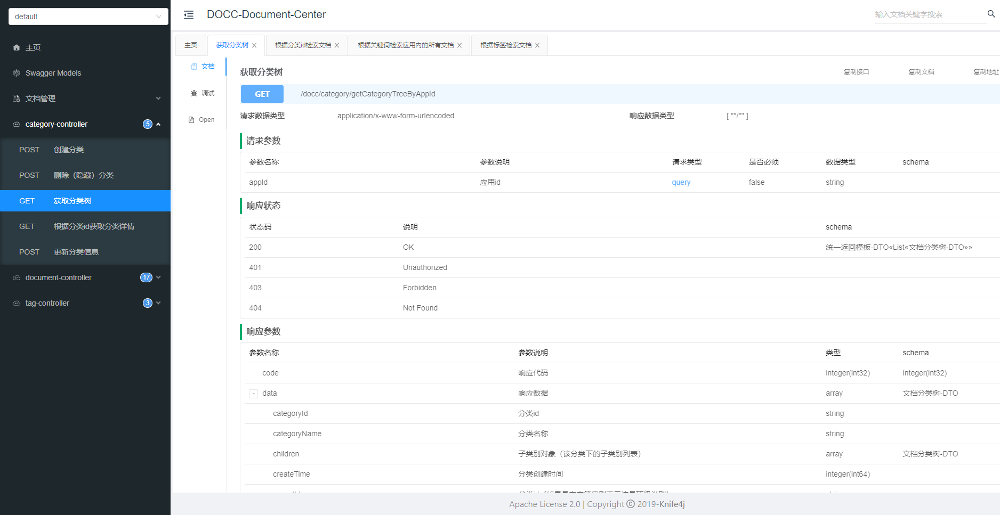

# DOCC-Document-Center
## 基于DDD+CQRS的文档检索中心（文档中台系统）
#### `在写`

***

### 实现功能
* 文档管理与检索
* 评论管理与展示
* 标签统计与查询
* 分类树的构建与展示
##### 对外提供`文档管理、文档多条件组合检索、评论管理、评论查询、标签统计与查询、树型分类结构生成、分类查询`等操作接口，可供博客应用、文库应用、公告应用等需要依靠文档检索功能的前台系统快速接入使用。
（注：所有更新操作均采用乐观锁机制，更新失败重试次数可在配置文件里设置）



***
### 系统架构



* 基于领域驱动与CQRS架构设计，四层架构（ui -> app -> domain -> infrastructure），代码层面读写分类。
* 数据存储：Elasticsearch与MariaDB，Elasticsearch存储文档数据，MariaDB存储分类、标签与评论数据。

#### 水平分层
* command `写入模块`
* query `查询模块`
  * document `文档模块`
  * category `分类模块`
  * tag `标签模块`
  * comment `评论模块`

#### 垂直分层
* sdk `sdk：提供表示层所需的传输对象`
* ui `表现层：提供对外接口服务以及配置服务`
* app `应用层：处理业务逻辑`
* domain `领域层：提供仓储服务，封装底层数据`
* infrastructure `基础服务层：提供DB、ES、以及常用工具服务`

***

### 接口文档
#### 启动项目后访问：http://localhost:8000/doc.html



***

### 存储格式
#### Elasticsearch索引（`文档`存储）
##### 索引名称：docc-document-center-product
##### 如果没有创建该索引，项目启动时会自动创建索引，但是mapping要自行用kibana创建

| 字段名称        | 字段解释                                           | 字段类型      |
|-------------|------------------------------------------------|-----------|
| id          | ES主键id                                         | `keyword` |
| app_id      | 文档所属应用id                                       | `keyword` |
| category_id | 文档所属分类id                                       | `keyword` |
| author_id   | 文档作者id（允许多个）                                   | `keyword` |
| document_id | 文档id                                           | `keyword` |
| title       | 文档标题                                           | `keyword` |
| content     | 文档内容                                           | `keyword` |
| tag         | 文档标签（允许多个）                                     | `keyword` |
| remarks     | 文档备注                                           | `keyword` |
| extra       | 文档附加内容（自定义）                                    | `keyword` |
| summary     | 文档总结摘要                                         | `keyword` |
| auth_level  | 文档查看权限级别（0～99自定义，用户权限等级如果低于authLevel，则不能查看该文章） | `Long`    |
| score       | 文档推荐分值（自定义，可按此字段对文档进行排序，用于热门文档推荐）`             | `Long`    |
| love_num    | 文档收藏数（可按此字段对文档进行排序）                            | `Long`    |
| like_num    | 文档点赞数（可按此字段对文档进行排序）                            | `Long`    |
| read_num    | 文档阅读数（可按此字段对文档进行排序）                            | `Long`    |
| share_num   | 文档分享数（可按此字段对文档进行排序）                            | `Long`    |
| comment_num | 文档评论数（可按此字段对文档进行排序）                            | `Long`    |
| filter      | 文档检索过滤条件（自定义，允许多个，例：1-仅自己可见、2-所有人可见）           | `Long`    |
| attr        | 文档属性（自定义，允许多个，例：1-转载文章、2-原创文章）                 | `Long`    |
| type        | 文档类型（自定义，例：0-普通文章，1-官方公告）                      | `Long`    |
| status      | 文档状态（0-删除，1-正常）                                | `Long`    |
| create_time | 文档创建时间                                         | `Long`    |
| update_time | 文档更新时间                                         | `Long`    |

#### MariaDB索引（`分类`、`标签`、`评论`、`子评论`存储）
```sql
create table category
(
    id            bigint unsigned auto_increment
        primary key,
    app_id        varchar(63)  not null comment '应用id',
    category_id   varchar(63)  not null comment '分类id',
    parent_id     varchar(63)  not null comment '父类id',
    category_name varchar(127) not null default '' comment '分类名称',
    detail        text                  default '' comment '详情',
    extra         text                  default '' comment '附加内容',
    score         bigint       not null default 0 comment '排序权值',
    attr          int          not null default 0 comment '属性',
    type          int          not null default 0 comment '分类',
    status        int          not null default 1 comment '状态（1-正常、0-删除）',
    version       bigint       not null default 0 comment '版本号（乐观锁）',
    create_time   bigint       not null default 0 comment '创建时间',
    update_time   bigint       not null default 0 comment '更新时间'
) ENGINE = InnoDB
  DEFAULT CHARSET = utf8;

create table tag
(
    id          bigint unsigned auto_increment
        primary key,
    app_id      varchar(63)  not null comment '应用id',
    tag_name    varchar(127) not null default '' comment '标签名称',
    number      bigint       not null default 0 comment '带有该标签的文档数量',
    status      int          not null default 1 comment '状态（1-正常、0-删除）',
    version     bigint       not null default 0 comment '版本号（乐观锁）',
    create_time bigint       not null default 0 comment '创建时间',
    update_time bigint       not null default 0 comment '更新时间'
) ENGINE = InnoDB
  DEFAULT CHARSET = utf8;

create table comment
(
    id              bigint unsigned auto_increment
        primary key,
    app_id          varchar(63) not null comment '应用id',
    document_id     varchar(63) not null comment '文档id',
    comment_id      varchar(63) not null comment '评论id',
    author_id       varchar(63) not null comment '作者id',
    content         text                 default '' comment '主体内容',
    extra           text                 default '' comment '附加内容',
    like_num        bigint      not null default 0 comment '点赞数',
    love_num        bigint      not null default 0 comment '收藏数',
    share_num       bigint      not null default 0 comment '转发数',
    sub_comment_num bigint      not null default 0 comment '子评论数',
    attr            int         not null default 0 comment '属性',
    type            int         not null default 0 comment '分类',
    status          int         not null default 1 comment '状态（1-正常、0-删除）',
    version         bigint      not null default 0 comment '版本号（乐观锁）',
    create_time     bigint      not null default 0 comment '创建时间',
    update_time     bigint      not null default 0 comment '更新时间'
) ENGINE = InnoDB
  DEFAULT CHARSET = utf8;

create table sub_comment
(
    id             bigint unsigned auto_increment
        primary key,
    app_id         varchar(63) not null comment '应用id',
    document_id    varchar(63) not null comment '文档id',
    comment_id     varchar(63) not null comment '评论id',
    sub_comment_id varchar(63) not null comment '子评论id',
    author_id      varchar(63) not null comment '作者id',
    reply_to       varchar(63) not null comment '回复对象id',
    content        text                 default '' comment '主体内容',
    extra          text                 default '' comment '附加内容',
    like_num       bigint      not null default 0 comment '点赞数',
    love_num       bigint      not null default 0 comment '收藏数',
    share_num      bigint      not null default 0 comment '转发数',
    attr           int         not null default 0 comment '属性',
    type           int         not null default 0 comment '分类',
    status         int         not null default 1 comment '状态（1-正常、0-删除）',
    version        bigint      not null default 0 comment '版本号（乐观锁）',
    create_time    bigint      not null default 0 comment '创建时间',
    update_time    bigint      not null default 0 comment '更新时间'
) ENGINE = InnoDB
  DEFAULT CHARSET = utf8;
```