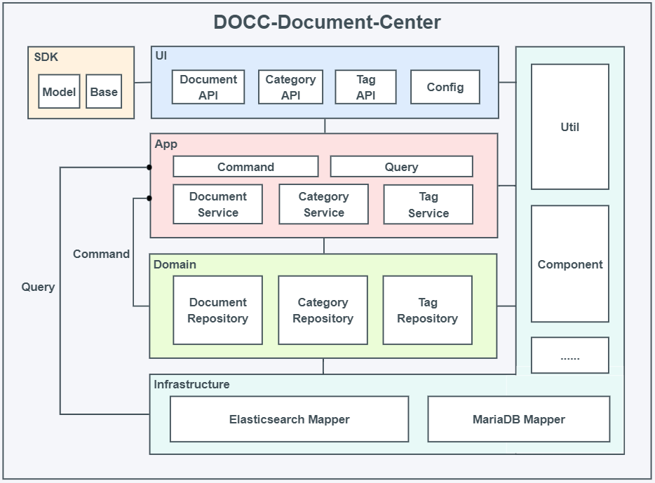

# DOCC-Document-Center
## 基于Elasticsearch的文档检索中心（文档中台系统）
#### `在写`
***

### 接口文档
#### 启动项目后访问：http://localhost:8000/doc.html

***

### 实现功能
文档插入、文档更新、文档多条件检索、标签统计与查询、树形分类结构生成、分类查询

***
### 系统架构

* 基于领域驱动与CQRS架构设计，四层架构（ui -> app -> domain -> infrastructure），代码层面读写分类。
* 数据存储：Elasticsearch与MariaDB，Elasticsearch存储文档数据，MariaDB存储分类与标签数据。

#### 水平分层
* command `写入模块`
* query `查询模块`
  * document `文档模块`
  * category `分类模块`
  * tag `标签模块`

#### 垂直分层
* sdk `sdk：提供表示层所需的传输对象`
* ui `表现层：提供对外接口服务以及配置服务`
* app `应用层：处理业务逻辑`
* domain `领域层：提供仓储服务，封装底层数据`
* infrastructure `基础服务层：提供DB、ES、以及常用工具服务`
***

### Elasticsearch索引
#### 索引名称：docc-document-center-product
#### 如果没有创建该索引，项目启动时会自动创建索引，但是mapping要自行用kibana创建
* id `ES主键id` `keyword`
* app_id `文档所属应用id` `keyword`
* category_id `文档所属分类id` `keyword`
* author_id `文档作者id` `keyword`
* document_id `文档id` `keyword`
* title `文档标题` `keyword`
* content `文档内容` `keyword`
* tags `文档标签` `keyword`
* summary `文档总结摘要` `keyword`
* auth_level `文档查看权限级别（0～99自定义，用户权限等级如果低于authLevel，则不能查看该文章）` `Long`
* score `文档推荐分值（自定义，可按此字段对文档进行排序，用于热门文档推荐）` `Long`
* love `文档收藏数（可按此字段对文档进行排序）` `Long`
* like `文档点赞数（可按此字段对文档进行排序）` `Long`
* read `文档阅读数（可按此字段对文档进行排序）` `Long`
* type `文档类型（自定义，例：0-普通文档，1-置顶文档）` `Long`
* status `文档状态（0-删除，1-正常）` `Long`
* create_time `文档创建时间` `Long`
* update_time `文档更新时间` `Long`

